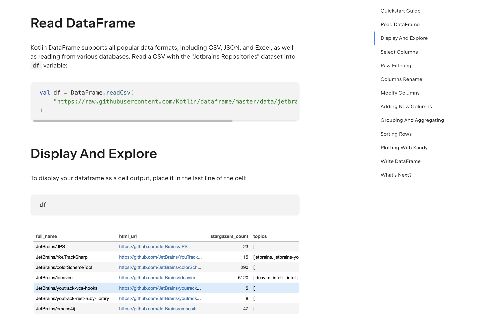
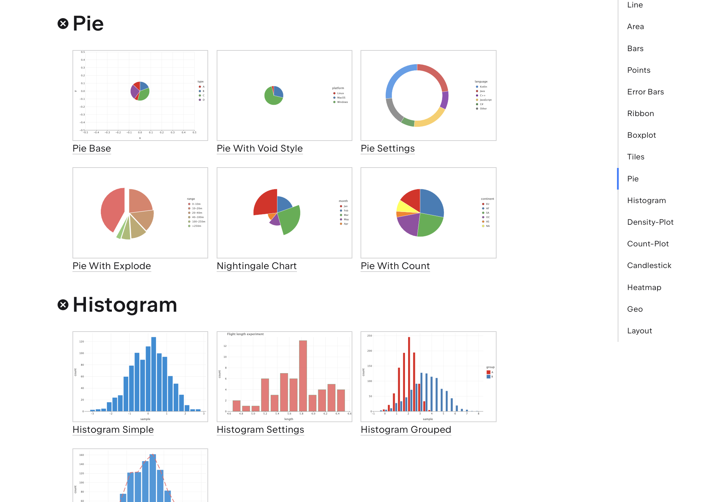

# Kotlin DataFrame: typesafe in-memory structured data processing for JVM
[](https://confluence.jetbrains.com/display/ALL/JetBrains+on+GitHub)
[](https://kotlinlang.org/docs/components-stability.html)
[](http://kotlinlang.org)
[](https://search.maven.org/artifact/org.jetbrains.kotlinx/dataframe)
[](https://search.maven.org/artifact/org.jetbrains.kotlinx/dataframe)
[](http://www.apache.org/licenses/LICENSE-2.0)
[](https://mybinder.org/v2/gh/Kotlin/dataframe/HEAD)

Kotlin DataFrame aims to reconcile Kotlin's static typing with the dynamic nature of data by utilizing both the full power of the Kotlin language and the opportunities provided by intermittent code execution in Jupyter notebooks and REPL.   

* **Hierarchical** — represents hierarchical data structures, such as JSON or a tree of JVM objects.
* **Functional** — data processing pipeline is organized in a chain of `DataFrame` transformation operations. Every operation returns a new instance of `DataFrame` reusing underlying storage wherever it's possible.
* **Readable** — data transformation operations are defined in DSL close to natural language.
* **Practical** — provides simple solutions for common problems and the ability to perform complex tasks.
* **Minimalistic** — simple, yet powerful data model of three column kinds.
* **Interoperable** — convertable with Kotlin data classes and collections.
* **Generic** — can store objects of any type, not only numbers or strings.
* **Typesafe** — on-the-fly generation of extension properties for type safe data access with Kotlin-style care for null safety.
* **Polymorphic** — type compatibility derives from column schema compatibility. You can define a function that requires a special subset of columns in a dataframe but doesn't care about other columns.

Integrates with [Kotlin kernel for Jupyter](https://github.com/Kotlin/kotlin-jupyter). Inspired by [krangl](https://github.com/holgerbrandl/krangl), Kotlin Collections and [pandas](https://pandas.pydata.org/)

## 🚀 Quickstart

Looking for a fast and simple way to learn the basics?  
Get started in minutes with our [Quickstart Guide](https://kotlin.github.io/dataframe/quickstart.html).

It walks you through the core features of Kotlin DataFrame with minimal setup and clear examples 
— perfect for getting up to speed in just a few minutes.



## Documentation

Explore [**documentation**](https://kotlin.github.io/dataframe) for details.

You could find the following articles there:

* [Guides and Examples](https://kotlin.github.io/dataframe/guides-and-examples.html)
* [Get started with Kotlin DataFrame](https://kotlin.github.io/dataframe/gettingstarted.html)
* [Working with Data Schemas](https://kotlin.github.io/dataframe/schemas.html)
* [Setup compiler plugin in Gradle project](https://kotlin.github.io/dataframe/compiler-plugin.html)
* [Full list of all supported operations](https://kotlin.github.io/dataframe/operations.html)
    * [Reading from SQL databases](https://kotlin.github.io/dataframe/readsqldatabases.html)
    * [Reading/writing from/to different file formats like JSON, CSV, Apache Arrow](https://kotlin.github.io/dataframe/read.html)
    * [Joining dataframes](https://kotlin.github.io/dataframe/join.html)
    * [GroupBy operation](https://kotlin.github.io/dataframe/groupby.html)
* [Rendering to HTML](https://kotlin.github.io/dataframe/tohtml.html#jupyter-notebooks)

### What's new

1.0.0-Beta2: [Release notes](https://github.com/Kotlin/dataframe/releases/tag/v1.0.0-Beta2)

Check out this [notebook with new features](examples/notebooks/feature_overviews/0.15/new_features.ipynb) in v0.15.

## Setup

> For more detailed instructions on how to get started with Kotlin DataFrame, refer to the
> [Getting Started](https://kotlin.github.io/dataframe/gettingstarted.html).

### Kotlin Notebook

You can use Kotlin DataFrame in [Kotlin Notebook](https://plugins.jetbrains.com/plugin/16340-kotlin-notebook),
or other interactive environment with Kotlin Jupyter Kernel support, such as
[Datalore](https://datalore.jetbrains.com/),
and [Kotlin Jupyter](https://github.com/Kotlin/kotlin-jupyter).

You can include all the necessary dependencies and imports in the notebook using *line magic*:

```
%use dataframe
```

You can use `%useLatestDescriptors`
to get the latest stable version without updating the Kotlin kernel:

```
%useLatestDescriptors
%use dataframe
```

Or manually specify the version:

```
%use dataframe($dataframe_version)
```

Refer to the 
[Get started with Kotlin DataFrame in Kotlin Notebook](https://kotlin.github.io/dataframe/gettingstartedkotlinnotebook.html)
for details.

### Gradle

Add dependencies in the build.gradle.kts script:

```kotlin
dependencies {
    implementation("org.jetbrains.kotlinx:dataframe:1.0.0-Beta2")
}
```

Make sure that you have `mavenCentral()` in the list of repositories:

```kotlin
repositories {
    mavenCentral()
}
```

Refer to the
[Get started with Kotlin DataFrame on Gradle](https://kotlin.github.io/dataframe/gettingstartedgradle.html)
for details.
Also, check out the [custom setup page](https://kotlin.github.io/dataframe/gettingstartedgradleadvanced.html) 
if you don't need some formats as dependencies,
for Groovy, and for configurations specific to Android projects.

## Code example

This example of Kotlin DataFrame code with
the [Compiler Plugin](https://kotlin.github.io/dataframe/compiler-plugin.html) enabled.
See [the full project](https://github.com/Kotlin/dataframe/tree/master/examples/kotlin-dataframe-plugin-example).
See also 
[this example in Kotlin Notebook](https://github.com/Kotlin/dataframe/tree/master/examples/notebooks/readme_example.ipynb).

```kotlin
val df = DataFrame
        // Read DataFrame from the CSV file.
        .readCsv("https://raw.githubusercontent.com/Kotlin/dataframe/master/data/jetbrains_repositories.csv")
        // And convert it to match the `Repositories` schema.
        .convertTo<Repositories>()

// Update the DataFrame.
val reposUpdated = repos
        // Rename columns to CamelCase.
        .renameToCamelCase()
        // Rename "stargazersCount" column to "stars".
        .rename { stargazersCount }.into("stars")
        // Filter by the number of stars:
        .filter { stars > 50 }
        // Convert values in the "topic" column (which were `String` initially)
        // to the list of topics.
        .convert { topics }.with {
            val inner = it.removeSurrounding("[", "]")
            if (inner.isEmpty()) emptyList() else inner.split(',').map(String::trim)
        }
        // Add a new column with the number of topics.
        .add("topicCount") { topics.size }

// Write the updated DataFrame to a CSV file.
reposUpdated.writeCsv("jetbrains_repositories_new.csv")
```

Explore [**more examples here**](https://kotlin.github.io/dataframe/guides-and-examples.html).

## Data model
* `DataFrame` is a list of columns with equal sizes and distinct names.
* `DataColumn` is a named list of values. Can be one of three kinds:
  * `ValueColumn` — contains data
  * `ColumnGroup` — contains columns
  * `FrameColumn` — contains dataframes

## Visualisations

[Kandy](https://kotlin.github.io/kandy/welcome.html) plotting library provides seamless visualizations 
for your dataframes.



## Kotlin, Kotlin Jupyter, Arrow, and JDK versions

This table shows the mapping between main library component versions and minimum supported Java versions.

| Kotlin DataFrame Version | Minimum Java Version | Kotlin Version | Kotlin Jupyter Version | Apache Arrow version |
|--------------------------|----------------------|----------------|------------------------|----------------------|
| 0.10.0                   | 8                    | 1.8.20         | 0.11.0-358             | 11.0.0               |
| 0.10.1                   | 8                    | 1.8.20         | 0.11.0-358             | 11.0.0               |
| 0.11.0                   | 8                    | 1.8.20         | 0.11.0-358             | 11.0.0               |
| 0.11.1                   | 8                    | 1.8.20         | 0.11.0-358             | 11.0.0               |
| 0.12.0                   | 8                    | 1.9.0          | 0.11.0-358             | 11.0.0               |
| 0.12.1                   | 8                    | 1.9.0          | 0.11.0-358             | 11.0.0               |
| 0.13.1                   | 8                    | 1.9.22         | 0.12.0-139             | 15.0.0               |
| 0.14.1                   | 8                    | 2.0.20         | 0.12.0-139             | 17.0.0               |
| 0.15.0                   | 8                    | 2.0.20         | 0.12.0-139             | 18.1.0               |
| 1.0.0-Beta2              | 8 / 11               | 2.0.20         | 0.12.0-383             | 18.1.0               |

## Code of Conduct

This project and the corresponding community are governed by the [JetBrains Open Source and Community Code of Conduct](https://confluence.jetbrains.com/display/ALL/JetBrains+Open+Source+and+Community+Code+of+Conduct). Please make sure you read it.

## License

Kotlin DataFrame is licensed under the [Apache 2.0 License](LICENSE).
